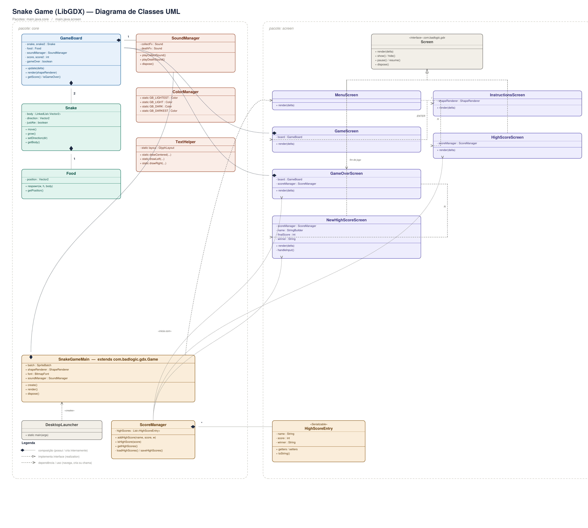

# 🐍 Multiplayer Snake Game

**Discipline:** SCC0204 - Object-Oriented Programming  
**Technology:** Java + LibGDX (Desktop Target)

## Group Identification
| Name | NUSP |
| :--- | :--- |
| Natália Carvalho | 15497232 |
| Nina Cunha Pinheiro | 13686500 |
| Thiago Ramos Pinto Silva | 14609446 |

---

## 1. Requirements
The project fulfills the following requirements proposed in the assignment description, alongside custom additions tailored by our team:
* **Game Setup:** LibGDX desktop project featuring a Main Menu, Instructions screen, and dynamic High Score screens.
* **Core Mechanics:** Two snakes move on a grid. They grow longer and speed up slightly when eating randomly spawned food.
* **Wrap-around Walls:** Snakes exiting one side of the screen seamlessly re-enter from the opposite side.
* **Collision Detection:** A snake dies if it hits its own body or the opponent's body.
* **Two-Player Controls:** Player 1 uses Arrow Keys; Player 2 uses WASD.
* **Scoring & End Conditions:** The game tracks the score, displays it in real-time, and ends when a collision happens, displaying the winner.
* **Sound Effects:** Audio integration for collecting food and game-over events.
* **Data Persistence:** The top 5 high scores are serialized and saved locally to `highscores.dat`.
* **Custom Additions:** Implementation of a strict 4-color GameBoy palette managed by a custom `ColorManager`, and an arcade-style 3-letter name input for saving records.

## 2. Project Description
The Multiplayer Snake Game is a real-time, competitive arcade game. Our application is structured using a Screen-based architecture provided by LibGDX, separating the game states (Menus, Gameplay, Game Over) into distinct classes to keep the rendering loop clean. The `GameBoard` acts as the logic hub, handling the real-time update loop (`delta` time) and managing the exact matrix positions of the snakes and the food.

**UML Class Diagram:**   
*(Note: This diagram illustrates our class hierarchy, associations, and the separation between UI screens and backend logic).*

## 3. Comments About the Code
To ensure code quality and maintainability, the project was built emphasizing Object-Oriented Programming (OOP) best practices:
* **Inheritance:** Our main class `SnakeGameMain` extends the LibGDX `Game` class. This inheritance allows our application to act as a state machine, holding global resources while seamlessly switching between different screens.
* **Polymorphism (Interfaces):** We heavily utilized the `Screen` interface from LibGDX. Classes like `MenuScreen`, `GameScreen`, and `GameOverScreen` all implement `Screen`. This polymorphic behavior allows `SnakeGameMain` to call `setScreen()` without needing to know the specific logic of the screen being rendered.
* **Encapsulation:** The entities (`Snake`, `Food`, `HighScoreEntry`) have their internal states (`LinkedList<Vector2>`, vectors, score values) strictly protected by `private` modifiers. Changes to a snake's size or direction are only possible through controlled public methods (`move()`, `grow()`, `setDirection()`), preventing external classes from corrupting the grid coordinates.
* **Separation of Concerns:** Graphical rendering is entirely separated from business logic. Peripheral logics were decoupled into managers (`ScoreManager` for File I/O Serialization, `SoundManager` for audio playback).
* **Documentation:** All logic classes contain Javadoc comments explaining their behavior to aid future reviewers.

## 4. Test Plan
We adopted a hybrid testing strategy, combining automated unit testing for business logic and manual testing for visual/audio rendering.
* **Automated Unit Tests (JUnit 5):** We created a suite of automated tests (`SnakeTest`, `FoodTest`, `ScoreManagerTest`) to evaluate isolated components. The tests verify if the snake grows correctly, prevents 180-degree immediate reverse turns, ensures the `Food` class never spawns coordinates out of the grid or overlapping a snake, and verifies if `ScoreManager` correctly sorts descending scores and trims the list to 5 items.
* **Manual UI/UX Tests:** Play full matches testing simultaneous keyboard inputs (P1 and P2). Force head-to-head collisions to verify the "Tie" scenario. Submit new high scores, close the game, and reopen it to check data serialization.

## 5. Test Results
* **Automated Tests:** `BUILD SUCCESSFUL`. All JUnit 5 tests passed with a 100% success rate. We successfully utilized a headless LibGDX extension to allow mathematical testing of vectors and grid logic without needing to open a graphical window.
* **Manual Tests:** The game speed correctly increments up to a predefined limit. Wrap-around walls work flawlessly on all 4 borders. Audio plays correctly without freezing the UI thread, and the serialization accurately ignores lower scores and properly saves 3-letter inputs.

## 6. Build Procedures
The project uses the Gradle wrapper, making it plug-and-play without manual IDE configuration.

**Prerequisites:**
* Java Development Kit (JDK) 17 or higher installed.

**Step-by-Step Guide:**
1. Clone the repository and access the folder:
   `git clone https://github.com/ninalwt/Programacao-Orientada-a-Objetos-2026`
   `cd Programacao-Orientada-a-Objetos-2026`
2. **To Run the Game:** Open your terminal in the "Programacao-Orientada-a-Objetos-2026" folder and execute:
   * **Linux/Mac:** `./gradlew run`
   * **Windows:** `gradlew.bat run`
3. **To Run the Automated Tests:** In the same terminal, execute:
   * **Linux/Mac:** `./gradlew test`
   * **Windows:** `gradlew.bat test`

*(Note: On the first run, Gradle will automatically download the LibGDX framework and JUnit dependencies via the internet).*

## 7. Problems
During development, we encountered and solved the following main challenges:
* **Font Rendering:** The default `FreeTypeFontGenerator` caused `NoClassDefFoundError` exceptions. We solved this by using the Hiero tool to pre-generate bitmap fonts (`.fnt` and `.png`), eliminating external dependencies.
* **Asset Path Resolution:** When running the game via certain IDEs, the working directory couldn't find the `assets/` folder, crashing the game when loading audio. We solved this by explicitly declaring the `resources` directory and `workingDir` in the `build.gradle` configuration, ensuring cross-platform compatibility.
* **Audio Freezing the Render Thread:** We originally used `Thread.sleep()` to wait for the death sound effect to finish before changing to the Game Over screen, which caused the LibGDX render thread to freeze. We fixed it by removing the sleep method and placing the `soundManager.playDeathSound()` call inside the constructor of the `GameOverScreen`, allowing the asynchronous audio engine to play the sound perfectly while the new screen renders.

## 8. Comments
Developing this project was a highly rewarding experience that allowed us to apply OOP principles in a real-time environment. Handling state management, understanding the LibGDX continuous rendering loop, and setting up automated testing in a graphical application drastically improved our software engineering skills.